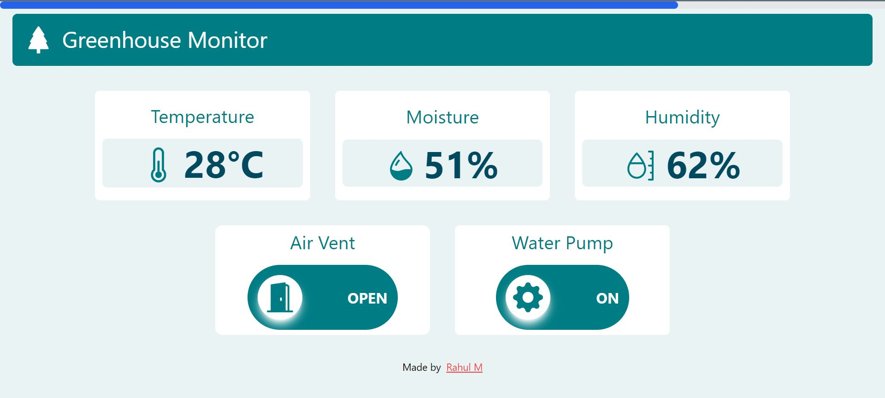

# `Greenhouse Monitor`

## About The Project


End-to-end project for monitoring various parameters of a
greenhouse. Uses MongoDB Atlas for storing the sensor data in the cloud, API built using Django and deployed in Heroku for
GET and POST requests to the sensor data in MongoDB Atlas, Arduino Uno with various sensors and Nodemcu for sending
the sensor data to the Django API, web app using VueJS for displaying the sensor data and monitoring the greenhouse.


## Frameworks and Technologies Used

* Django Rest Framework for the backend.
* MongoDB atlas for the database.
* VueJS for the frontend.
* Tailwindcss for styling.
* Heroku for deploying the backend
* Netlify for deploying the frontend

## Running the application
Since I have used mongoDB atlas for the backend, when running this application on your own, you have to provide your own URL for the mongoDB atlas host in `backend/project/settings.py`. You may also want to change the URL for the API in `frontend/src/stores/sensor.js` if you wish to use your own local development backend server. Use the below commands to start the backend and the frontend.

### Backend
```sh
cd backend
sh setup.sh  # run this only once
python3 manage.py runserver
```

### Frontend
```sh
cd frontend
npm run dev
```
You can now access the app at http://localhost:3000.
